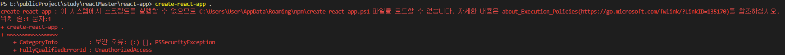

# React 가이드 - 환경 구축 및 배포하는 법

제작자 - 박솔

- - -

## 제작 이유

<생활코딩 리액트 프로그래밍>과 <클론 코딩 트위터> 두 교재를 통해 리액트 공부를 했으나,  
워낙 방대한 양을 한꺼번에 공부하다보니 헷갈리는 부분이 많아서 제대로 정리하기 위해 제작하게 되었다.  
목적은 말했다시피 "제대로 짚고 넘어가기"이기 때문에 시간이 오래 걸리더라도 확실히 아는 것이 중요할 것이다.  
개인적인 정리가 목적이니 불친절한 부분이 많을 수 있다. 너무 당연하여 굳이 정리가 필요없는 부분은 생략한다.

- - -

## 1. 개발 환경 구축

create-react-app을 사용하여 개발 환경을 구축한다.  
그러나 여기서 문제가 발생했다.

전에 설치했을 때는 이상 없었는데 갑작스레 이런 문제가 발생한 것.  
서치를 통해 문제 해결책을 살펴 보았다.  
  
이는 **스크립트 실행 권한이 제한되어 있는 상태**이기 때문이라고 한다.  
스크립트 실행 권한을 변경하기 위해서는 **Windows PowerShell을 관리자 권한으로 실행**해서 변경해줘야 한다.  
  
- - -

### **1. Windows PowerShell 관리자 권한으로 실행**

말 그대로 검색을 통해 Windows PowerShell을 관리자 권한으로 실행한다.

### **2. 권한 변경**

    > Set-ExecutionPolicy RemoteSigned
    > [A] 모두 예

### **3. 변경된 권한 확인**

    > Get-ExecutionPolicy
    RemoteSigned

이제 create-react-app을 설치할 수 있게 되었다.

- - -

## 2. JS 코딩하는 법

간단하게 App.js가 index.html에 어떤 방식으로 연결이 되는지 알아보자.  
  
index.html 파일은 이미 그 의미를 알고있다. 이 파일에서 주목해야할 부분은

    

이 부분이다. 그 다음으로 봐야할 부분은 index.js다.  
이 파일은 **앱의 진입점 역할**을 한다.

    const root = ReactDOM.createRoot(document.getElementById('root'));
    root.render(
    <React.StrictMode>
        <App />
    </React.StrictMode>
    );

우선 통으로 가져왔다. 주목할 부분은

    document.getElementById('root')

이 부분인데, id가 "root"인 태그를 선택하는 자바스크립트의 선택자 문법이다.  
바로 index.html에서 봤던 그 태그이다.  

여기서 \<App />이라고 적힌 부분이 바로 **리액트를 통해 만든 사용자 정의 태그 (컴포넌트)** 이다.
그리고 이것은 import App from './App'; 를 통해 가져온다.

한마디로 index.html > index.js > app.js 순으로 가져오게 되는 것이다.

- - -

## 3. 배포하는 법

create-react-app을 이용해서 만든 파일은 용량이 크다. 또한 이 상태로 제공될 시 보안의 문제가 발생할 수 있다.  
그렇기에 우리는 빌드(build)를 한다.

    npm run build

이 명령어를 실행하면 build라는 폴더가 생긴다. 이 폴더 안의 index.html 파일을 확인해보면,  
공백이 하나도 없고 읽을 수 없다. 불필요한 정보들을 삭제하여 용량이 훨씬 줄어들었기 때문이다.

결론적으로 실제로 앱을 서비스할 때는 **build 안에 있는 파일들을 사용**해야 한다.  

build 폴더만을 그대로 깃에 올려서 적용이 되는지 한 번 살펴보자.  
지옥으로부터 돌아왔다. 또 이런 불상사가 일어나지 않게하기 위해 적어보겠다.

우선 이번 핵심 요소들은 크게 세가지였다.  
1. master = 전체 파일을 넣어주는 기능
2. gh-pages = 그 중에서 build 파일만 보이게 해주는 기능
3. **빈 css 파일을 가지고 있으면 안 된다.**

3번이 제일 중요하다. 결국 모든 문제의 원흉은 3번이었다. 피를 보고싶지 않다면 알아두자.

 

### **깃으로 배포하기**

이 글에서는 깃으로 배포하는 방법에 대해서만 다룬다.  
우선 깃을 만들고 새 레포지토리를 판다. (안 파도 기존 거 써도 되긴 함)

 

#### **(1) Git과 React 프로젝트 연결**

    git remote add origin https://github.com/깃허브ID/레포지토리NAME
    git push -u origin master

remote가 이미 있을 경우 확인해주고 원하는 것과 다르면 삭제하고 다시 remote해주면 되고,  
git push -u origin master같은 경우 master 내에 넣어주는 것이다. (아닐 수도 있는데 이렇게 이해해도 지장X)

 

#### **(2) package.json 설정**

    // package.json
    (scripts 내부) "deploy": "gh-pages -d build"
    "homepage": "https://깃허브ID.github.io/레포지토리NAME

package.json에 들어가보면 제일 상단 {} 내에 homepage를 넣어주고,  
scripts 내에 deploy 명령어를 정의해준다.

 

#### **(3) gh-pages 라이브러리 설치**

    npm install gh-pages --save-dev

사실 책에서는 그냥 npm install gh-pages이지만 --save-dev를 붙이는 이유는 https://ingorae.tistory.com/1754 에서 확인해보자.

 

#### **(3) package.json 설정**

npm run deploy를 입력하여 배포를 실행시킨다.

 

#### **(4) Git Branch 설정**

개고생했으니 이것이 얼마나 중요한지는 알 것이다.  
git branch 설정을 gh-pages 설정 후 저장하면 해당 주소에서 우리의 react 프로젝트를 확인할 수 있다.  

왜 gh-pages인가? 에 대해 설명을 덧붙이자면, master에는 리액트의 모든 파일이 들어간다.  
이렇게 되면 무게도 무겁고 보안 문제가 발생할 수 있다.  
하지만 gh-pages로 branch를 설정하면 build 파일만 나타난다. 무게가 가볍고 보안도 지킬 수 있는 것이다.  

우선 이 md 파일을 통해 웬만큼은 할 수 있을 것이다... 또 다른 문제가 발생하여 이 파트가 수정되는 일이 없길 바란다.  
이제 본격적으로 리액트를 사용하는 방법을 알아보겠다.

- - -

[02.React](./02_React.md)
